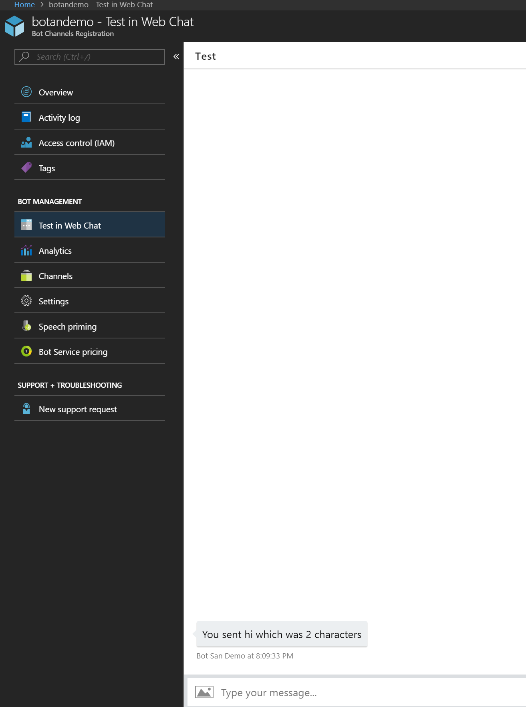
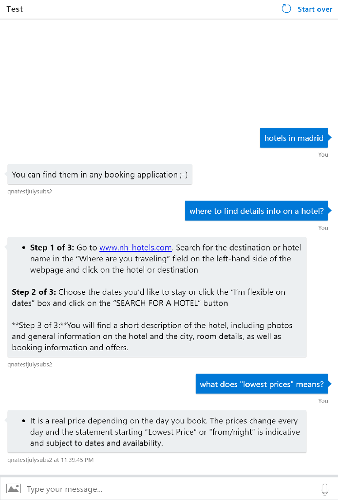

_Image Credit: maxuser / Shutterstock_

# Hands On Lab 
# Basic Level for Bots on Azure
# Overview Bot Framework
Microsoft Bot Framework is a comprehensive offering to build and deploy high quality bots for your users to enjoy in their favorite conversation experiences. Developers writing bots all face the same problems: bots require basic I/O; they must have language and dialog skills; they must be performant, responsive and scalable; and they must connect to users – ideally in any conversation experience and language the user chooses. Bot Framework provides just what you need to build, connect, manage and publish intelligent bots that interact naturally wherever your users are talking – from text/sms to Skype, Slack, Facebook Messenger, Kik, Office 365 mail and other popular services. This lab will show you how to build a basic bot, connect it to a LUIS model, and get responses back.  

### Objectives 

* Create an echo chat Bot
* Create a LUIS model
* Integrate a LUIS model into an existing Bot
* Create a QnA Bot
* Use the Bot Framework Emulator to test your Bot


### Prerequisites (try to do before the lab starts)

We will be using the Microsoft Bot Framework NodeJS SDK to build the bot web service and utilize some NPMs and open source SDKs along with Cognitive Services APIs.

- Install [NodeJS](https://nodejs.org/en/). After you've installed this, open your command line and run `npm install npm -g`. This updates Node's Package Manager (npm) to the latest version.
- Install [Visual Studio Code](https://code.visualstudio.com/) (or any other code editor of your choice)
- Install [Bot Framework emulator](https://emulator.botframework.com)


# Challenge 1 – Set up your Bot


## Challenge
Your challenge is to create a Service Bot using the Azure Portal and navigate through the different options and properties.

## Success Criteria
You should be able to test your service bot using [Web Chat](https://docs.microsoft.com/en-us/azure/bot-service/bot-service-manage-test-webchat?view=azure-bot-service-3.0) or Bot Emulator. Your basic bot should respond at least an echo message.

 
## References
### Read me first
* Definitions and some common terms in Bots [Bots & Business](https://medium.com/ux-for-bots/ux-for-bots-must-read-articles-123e744a7ff1)
* Create a Bot Service Documentation [Ref.](https://docs.microsoft.com/en-us/azure/bot-service/bot-service-quickstart?view=azure-bot-service-3.0)

### Azure Portal 
* Review of Azure portal and [Azure Portal features](https://azure.microsoft.com/en-us/features/azure-portal/)

### Coding a Bot
* Edit your Bot using Online Code Editor: [Ref](https://docs.microsoft.com/en-us/zure/bot-service/bot-service-build-online-code-editor?view=azure-bot-service-3.0)
* Bot builder SDK for NodeJS [Ref](https://docs.microsoft.com/en-us/azure/bot-service/nodejs/bot-builder-nodejs-quickstart?view=azure-bot-service-3.0)

### **Alternative: for advanced users only** 

Create a folder for your bot code and run `npm init` to start your nodejs project. You can enter the description for your bot and author name. 

If you check your bot's folder now, there should be a package.json file. [package.json](https://docs.npmjs.com/files/package.json) is like a description of the project, such as which packages our node project uses. Now you need to run the following 2 commands separately in the command line to install the botbuilder and restify packages (each of the packages may take a while to finish installing):

```shell
npm install --save botbuilder
npm install --save restify
```

Microsoft's [BotBuilder](https://www.npmjs.com/package/botbuilder) is a framework we use to build our bot by handling stuff such as dialogs and storing info about the user. [Restify](https://www.npmjs.com/package/restify) exposes our bot through an API so that other web services can talk to it. The `--save` flag automatically updates the package.json file to show that BotBuilder and Restify are dependencies in our project.

Open up Visual Studio Code. Go to File > Open Folder... and select your bot's folder.

The node_modules folder contains all the packages and dependencies needed in our project. If you look into the folder, you'll see more than just the botbuilder and restify packages we installed - that's because they require other packages to work as well.

Right click the left panel area and create a new file. Name it `index.js`. **Make sure the new file is created at the root of your bot's folder.**

You can copy and paste the following snippet of code into `index.js`:

```js
// Reference the packages we require so that we can use them in creating the bot
var restify = require('restify');
var builder = require('botbuilder');

//=========================================================
// Bot Setup
//=========================================================

// Setup Restify Server
// Listen for any activity on port 3978 of our local server
var server = restify.createServer();
server.listen(process.env.port || process.env.PORT || 3978, function () {
   console.log('%s listening to %s', server.name, server.url); 
});
  
// Create chat bot
var connector = new builder.ChatConnector({
    appId: process.env.MICROSOFT_APP_ID,
    appPassword: process.env.MICROSOFT_APP_PASSWORD
});
var bot = new builder.UniversalBot(connector);
// If a Post request is made to /api/messages on port 3978 of our local server, then we pass it to the bot connector to handle
server.post('/api/messages', connector.listen());

//=========================================================
// Bots Dialogs
//=========================================================

// This is called the root dialog. It is the first point of entry for any message the bot receives
bot.dialog('/', function (session) {
    // Send 'hello world' to the user
    session.send("Hello Spain");
});
```

At the moment, the bot sends "Hello Spain" to the user every time it receives a message. To talk to our bot, we will use the [Bot Framework Emulator](https://docs.botframework.com/en-us/tools/bot-framework-emulator/). 

From the command prompt run `node index.js`. This basically runs the index.js file, which is the starting point of our bot.


# Challenge 2 – Making Bot smarter with Cognitive Services - LUIS

## Challenge

You should create a bot that could respond to different questions about hotel accomodation in different cities. It also should recognize greetings and asking for help intents.

Your ''conversational intelligence'' service should extract intent and entities from user’s statements and feeds the result to your bot.

Review the references and documentation below.

##  Success Criteria
You should be able to test your bot, it should respond something about the intent you are asking. You should test it by using Web Chat or Emulator.


## References

You should create an account at [LUIS.ai USA](https://luis.ai) or [LUIS.ai in EU](https://eu.luis.ai).

The <a href="https://www.microsoft.com/cognitive-services/en-us/language-understanding-intelligent-service-luis" target="_blank">Language Understanding Intelligent Service (LUIS)</a> is able to process natural language using pre-built or custom-trained language models. More details can be found on [Language understanding for bots](https://github.com/MicrosoftDocs/bot-framework-docs/blob/live/articles/v4sdk/bot-builder-concept-luis.md)

Language Understanding allows your application to understand what a person wants in their own words. LUIS uses machine learning to allow developers to build applications that can receive user input in natural language and extract meaning from it.

To make it easy in Visual Studio, you can use the templates for Language understanding

###  [Microsoft Cognitive Services](https://www.microsoft.com/cognitive-services) control for [Microsoft Bot Builder](https://github.com/microsoft/botbuilder)

The Cognitive Services control makes consuming different Microsoft Cognitive Services easy for bots developed using [Microsoft Bot Builder](https://github.com/microsoft/botbuilder) SDK.

- Language Understanding Intelligent Service (LUIS) enables developers to build smart applications that can understand human language and react accordingly to user requests. There are times when you may want to link an intent to an action at client side (e.g.: in your Bot, or web app, or even a console app), with an easy binding logic for it, where you can also resolve complex things in order to fulfill an user's intent.

### Dialogs
Dialogs are the main component of your Bot. Every dialog handles a specific part of conversation and acts a bit like a controller, mediating between the user and business logic embedded in your services.

There are two kinds of dialogs:

* Luis dialogs. These inherit from `LuisDialog`. They call LUIS APIs to infer user’s intent and then call a specific method within the dialog based on the inference
* Regular dialog. These implement `IDialog`. They can use more traditional means of inferring user intent (e.g. using Regex, listed options, …)

### Your LUIS APP

The first step to using LUIS is to create or import an application. Once you created or imported the application you'll need to "train" the model ([Training](https://docs.microsoft.com/en-us/azure/cognitive-services/luis/train-test)) before you can "Publish" the model in an HTTP endpoint. For more information, take a look at [Publishing a Model](https://docs.microsoft.com/en-us/azure/cognitive-services/luis/publishapp).


#### Where to find the Model URL

In the LUIS application's dashboard, click the "Publish" button in the top bar and click on the "Publish to production slot". From the region list below, select your preferred region and copy the link as-is.


### More Information
Read these resources for more information about the Microsoft Bot Framework, Bot Builder SDK and LUIS:

* [Microsoft Bot Framework Overview](https://docs.botframework.com/en-us/)
* [Microsoft Bot Framework Bot Builder SDK](https://github.com/Microsoft/BotBuilder)
* [Microsoft Bot Framework Samples](https://github.com/Microsoft/BotBuilder-Samples)
* [Understanding Natural Language](https://docs.microsoft.com/en-us/bot-framework/cognitive-services-bot-intelligence-overview#language-understanding)
* [LUIS Help Docs](https://www.luis.ai/Help/)
* [Cognitive Services Documentation](https://docs.microsoft.com/en-us/azure/cognitive-services/luis/)


# Challenge 3 – Making Bot smarter with Cognitive Services -QnA

## Challenge

You should create a bot that could response to different questions about hotel accomodation in different cities.

Your ''conversational intelligence'' service should extract your question from a knowledge data base and feeds the result to your bot.

Review the references and documentation below.

##  Success Criteria
You should be able to test your bot using your QnA knowledge base, it should respond question about hotels.


## References

You should create a knowledge base at [QnA Maker](https://qnamaker.ai). Log in to QnAMaker.ai with your Azure credentials.
This is a free tool under Cognitive Services with a limit of 10,000 transactions per month, 10 per minute.

* Create a QnA Maker service [Ref](https://docs.microsoft.com/en-us/azure/cognitive-services/QnAMaker/how-to/set-up-qnamaker-service-azure)

* Create a QnA Bot Service [Ref](https://docs.microsoft.com/en-us/azure/cognitive-services/QnAMaker/tutorials/create-qna-bot)

Alternative: you can create everything by code using QnA API
* [NodeJs](https://docs.microsoft.com/en-us/azure/cognitive-services/QnAMaker/quickstarts/nodejs)
* [Java](https://docs.microsoft.com/en-us/azure/cognitive-services/QnAMaker/quickstarts/java)
* [C#](https://docs.microsoft.com/en-us/azure/cognitive-services/QnAMaker/quickstarts/csharp)
* [Python](https://docs.microsoft.com/en-us/azure/cognitive-services/QnAMaker/quickstarts/python)
* [Go](https://docs.microsoft.com/en-us/azure/cognitive-services/QnAMaker/quickstarts/go)

###  [Microsoft Cognitive Services](https://www.microsoft.com/cognitive-services) control for [Microsoft Bot Builder](https://github.com/microsoft/botbuilder)

The Cognitive Services control makes consuming different Microsoft Cognitive Services easy for bots developed using [Microsoft Bot Builder](https://github.com/microsoft/botbuilder) SDK.

- [QnA Maker](https://qnamaker.ai/): This service enables developers to build, train and publish a simple question and answer bot based on FAQ URLs, structured documents or editorial content. The bot can consume the QnA Maker dialog implemented by this control to forward the conversation to QnA Maker service and relay back the answers to the user.

